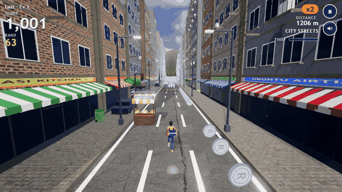
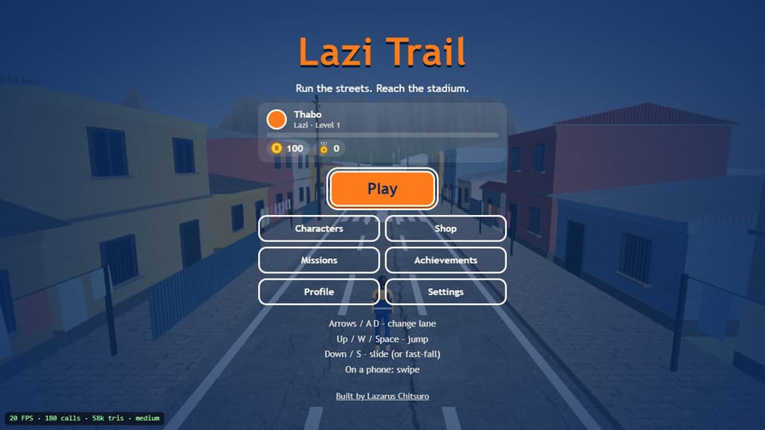
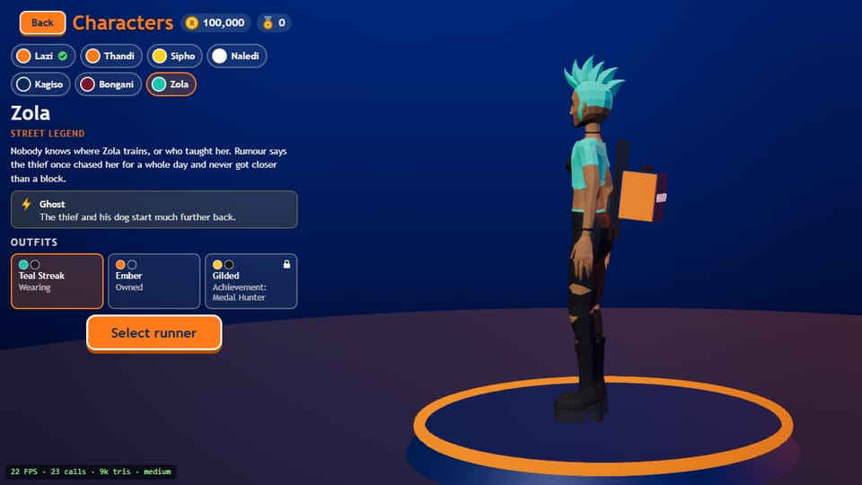
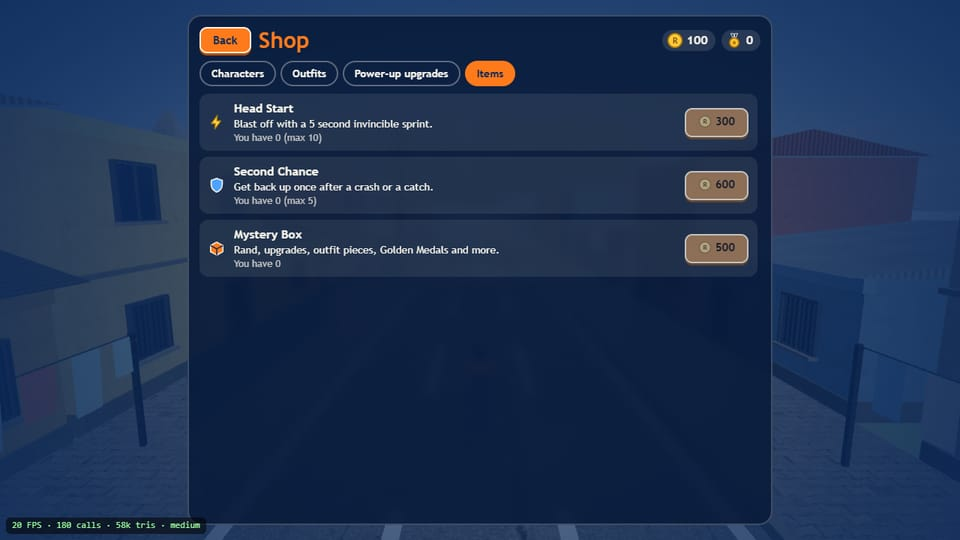
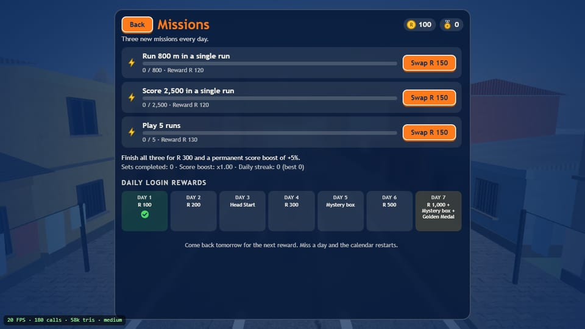
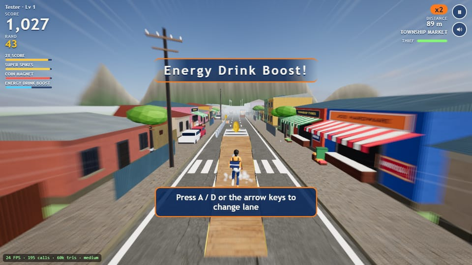
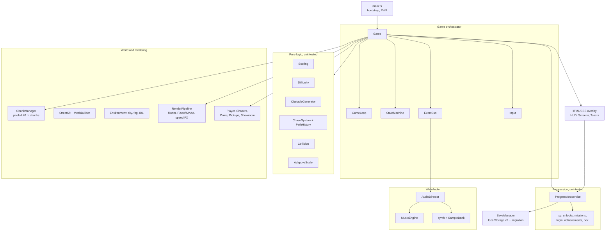

# Lazi Trail

**A 3D endless runner through South African streets, playable in the browser.**
Lazi is carrying her medal and her kit bag to the stadium, and a thief with his dog is on her heels. Dodge taxis and trains, ride ramps onto roofs, collect Rand, and unlock a squad of original South African runners.



**Play it:** deploy your own copy in a couple of minutes ([Cloudflare Pages steps](#deploy-to-cloudflare-pages)) — the live link goes here once it is published: `https://lazi-trail.pages.dev` (expected address; not deployed yet).

Built by [Lazarus Chitsuro](https://github.com/chitsurolazarus-alt).

## Features

- **Four zones** with their own look, sky, ambience and obstacles: Township Market, City Streets, Train Yard, Stadium Approach.
- **A real chase.** The thief and his dog replay Lazi's exact route, so they never clip through anything. Stumble once and they close in; stumble again while they are close and you are caught. Hit an obstacle head-on and they run up and snatch the bag.
- **Fair, endless generation.** Obstacle rows always leave one lane passable (unit-tested in every zone), the first minute is deliberately easy, and difficulty ramps with speed.
- **Seven playable runners** with a bio, a small perk and outfits each: Lazi, Thandi (netball), Sipho (football), Naledi (long jump), Kagiso (marathon), Bongani (rugby) and the secret Zola. A 3D character room lets you spin them on a podium; locked ones show as silhouettes.
- **Progression:** player levels and XP, daily missions with rerolls and a permanent score boost, a 7-day login calendar, 49 achievements with toasts, mystery boxes, a shop, a local top-10 and a first-run tutorial.
- **Four power-ups** with hand-built 3D models, HUD timers and shop upgrades: Coin Magnet, Energy Drink Boost, Super Spikes and 2x Score. Head Start and Second Chance items are bought with in-game Rand (no real money anywhere).
- **Sound:** an Amapiano-flavoured soundtrack synthesised live in Web Audio that builds as you speed up and when the thief is close, zone ambience, positional traffic and thief/dog voices, and 34 recorded effects.
- **Quality settings** (Low / Medium / High) detected on first run, changeable any time, plus an automatic resolution scaler that protects frame rate on slow devices.
- **Installable and offline-capable** (PWA) with an "Install Lazi Trail" button; social-share cards and structured data for search.

| Main menu                               | Character room                                         |
| --------------------------------------- | ------------------------------------------------------ |
|  |  |
| **Shop**                                | **Missions and daily rewards**                         |
|       |              |



## Controls

| Action                          | Keyboard            | Touch              |
| ------------------------------- | ------------------- | ------------------ |
| Change lane                     | `←` `→` or `A` `D`  | Swipe left / right |
| Jump                            | `↑`, `W` or `Space` | Swipe up           |
| Slide (or fast-fall in the air) | `↓` or `S`          | Swipe down         |
| Pause                           | `Esc` or `P`        | Pause button       |

Menus work with mouse, touch and keyboard (Tab / Enter).

## Tech stack

Three.js r186 · TypeScript (strict) · Vite · Vitest · ESLint + Prettier. No backend and no runtime dependencies besides Three.js; progress is saved in `localStorage`.

## Architecture



World convention: the player stays at `z = 0` running toward `-Z`; the world scrolls toward `+Z`. Everything that spawns is pooled, coins are two instanced meshes, and street scenery is merged per-material geometry built in a few variants per zone. See [`CLAUDE.md`](CLAUDE.md) for the full module map and rules.

## Technical challenges

- **A chase that can't cheat.** The pursuers do not path-find; they replay a recording of Lazi's own route (`PathHistory`) a few metres behind. They can never cut a corner or clip an obstacle, and "how close are they" is just a number the pure `ChaseSystem` moves.
- **Fairness in an endless generator.** Every row picks a "safe lane" that drifts at most one lane per row and never gets a blocking obstacle, moving vehicles reserve the lane they sweep, and a property test proves a route exists for every zone, seed and difficulty.
- **Thousands of draw calls become hundreds.** Street kits are merged into one geometry per material with vertex colours and world-scaled UVs, coins are two instanced meshes, lamps and trees are instanced props, and low quality swaps in primitive models. Draw calls: about 45 (Low), 180 (Medium), 400 (High).
- **Music without music files.** The soundtrack is a small groove box (log drum, shaker, piano stabs, plucks) scheduled ahead on the Web Audio clock; three layers fade in with speed and chase pressure. Sounds that pass by are panned with `PannerNode`.
- **Save data that survives updates.** The save is validated field by field, versioned, and migrated (v1 → v2 is covered by tests, and the old data is never modified).
- **Smooth on weak devices.** An adaptive scaler lowers render resolution in small steps when frames run long and raises it again with hysteresis; a 12-minute (20 km) soak shows flat memory and stable GPU resource counts.

## Run it locally

```bash
npm install
npm run dev        # http://localhost:5173
npm test           # unit tests
npm run lint       # ESLint
npm run build      # type-check + production build into dist/
npm run preview    # serve the production build
```

Dev-only extras: `?quality=low|medium|high`, `?debug` (FPS and draw calls), `?adaptive=0`, `?gallery=obstacles|characters|lazi|chasers|powerups` (dev server), and `window.__lazi` helpers for testing.

Third-party assets are downloaded and optimised by `npm run assets` (already checked in), and icons / social image are generated by `npm run icons`.

## Deploy to Cloudflare Pages

1. Push this repository to GitHub.
2. In the Cloudflare dashboard: **Workers & Pages → Create → Pages → Connect to Git**, pick the repository.
3. Build settings: framework preset **None**, build command `npm run build`, output directory `dist`, Node 20 or newer.
4. Optional: add an environment variable `SITE_URL` (for example `https://your-name.pages.dev` or your own domain) so the canonical link, share image and sitemap use the real address.

`public/_headers` already sets caching and security headers. The first visit downloads the game; after that the service worker keeps it available offline.

## Quality notes

The Low / Medium / High profiles live in `src/config/quality.ts`. Frame rates were checked by automated soak tests and headless rendering only; treat the numbers above as draw-call budgets rather than promises about your device, and use Settings → Graphics quality if it runs slowly.

## Credits and licences

Original game code by Lazarus Chitsuro, released under the [MIT licence](LICENSE). All third-party art and audio is CC0 or otherwise royalty-free and is listed in [`CREDITS.md`](CREDITS.md): Poly Haven (textures and skies), Quaternius (character models), Kenney and OpenGameArt (sound effects). Music, voices and the power-up models are made in code. All shop, brand and street names in the game are fictional, and the characters are original.
